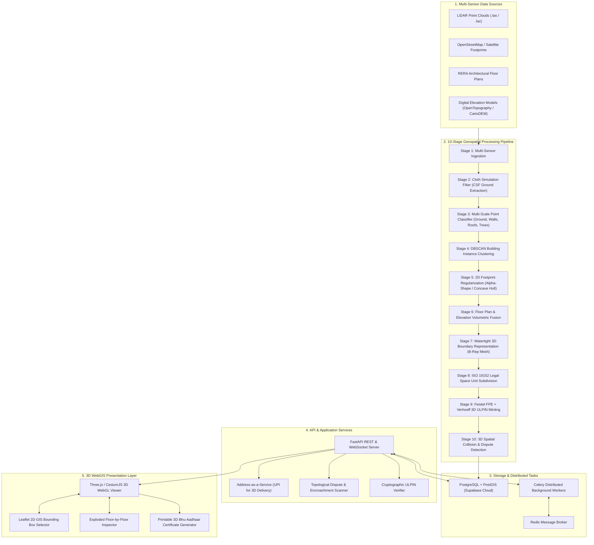
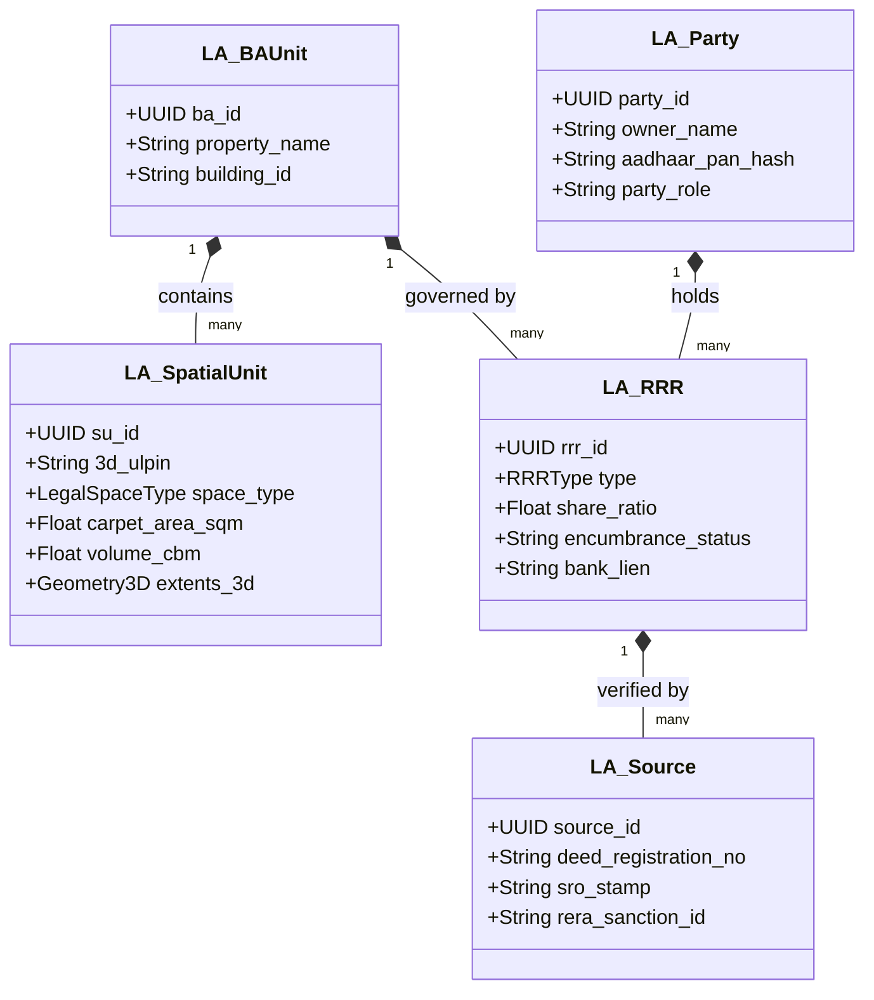

# 🏛️ vkarma: 3D Cadastral Registry & 3D ULPIN System
### National 3D Land Record Digital Twin & Automated Geospatial Processing Pipeline
#### Compliant with ISO 19152 Land Administration Domain Model (LADM)

[](https://www.iso.org/standard/51206.html)
[](https://fastapi.tiangolo.com/)
[](https://threejs.org/)
[](https://supabase.com/)
[](https://docs.celeryq.dev/)
[](#3d-ulpin-cryptographic-architecture)
[](LICENSE)

---

## 📖 Executive Summary & Vision

Traditional land registries operate on **two-dimensional (2D) parcel boundaries**. In modern high-density urban environments, multi-storey residential complexes, commercial skyscrapers, underground utility tunnels, transit corridors, and elevated air rights coexist within the same horizontal footprint. A 2D cadastre cannot disambiguate:
- Who owns apartment 1402 on the 14th floor versus apartment 202 on the 2nd floor directly beneath it.
- Where private ownership ends and undivided common property (corridors, elevator shafts, fire escapes) begins.
- Unauthorized structural encroachments into shared amenities or overlapping deed claims.
- Subsurface infrastructure (metro tunnels, power conduits, sewage mains) and overhead air rights.

**vkarma** solves this fundamental limitation by delivering an **end-to-end 3D Cadastral Digital Twin & Land Administration System**. Aligned with the international **ISO 19152 Land Administration Domain Model (LADM)** and India's **Digital India Land Records Modernization Programme (DILRMP) / Bhu-Aadhaar** initiative, the platform converts raw survey data (aerial LiDAR point clouds, drone photogrammetry, satellite footprints, and RERA floor plans) into structured, legally unambiguous 3D digital records.

Every space—whether a residential unit, parking bay, elevator shaft, or air-rights envelope—receives an immutable, non-sequential, tamper-checked **3D ULPIN** (`PPPPPP-T-RRRRRRRR-C`).

---

## 🏛️ System Architecture



---

## 🔬 The 10-Stage Geospatial AI/ML & Cadastral Pipeline

The platform processes raw geographic survey data through a sequential, deterministic 10-stage pipeline:

| Stage | Name | Technical Implementation | Purpose |
|:---:|:---|:---|:---|
| **01** | **Multi-Sensor Ingestion** | `lidar_fetcher.py`, `building_discovery.py` | Ingests `.las` / `.laz` point clouds, OpenStreetMap building vectors, OpenTopography elevation data, and architectural CAD/PDF plans. |
| **02** | **Cloth Simulation Filter (CSF)** | `csf_filter.py` | Inverts point clouds upside down and drapes a virtual physical cloth to classify real bare-earth terrain from above-ground objects. |
| **03** | **Multi-Scale Point Classifier** | `point_classifier.py` | Computes local 3D geometric eigenvalues ($\lambda_1, \lambda_2, \lambda_3$), planarity, sphericity, and verticality to classify points into Ground (Class 2), Vegetation (Class 4/5), and Building Shell (Class 6). |
| **04** | **Building Instance Clustering** | `clustering.py` | Runs DBSCAN (Density-Based Spatial Clustering of Applications with Noise) on building shell points to separate distinct physical structures with road setbacks. |
| **05** | **Footprint Regularization** | `footprint_extractor.py` | Computes 2D concave hulls (Alpha-Shapes) and performs orthogonalization / right-angle regularization of building ground profiles. |
| **06** | **Floor Plan & Elevation Fusion** | `extrusion_engine.py` | Fuses vertical building heights with RERA floor plan layouts to allocate storey heights, parapets, and basement levels. |
| **07** | **Physical Unit Mesh Generation** | `extrusion_engine.py` | Synthesizes watertight 3D polyhedral boundary representations (B-Rep) for each building envelope. |
| **08** | **ISO 19152 Legal Space Subdivision** | `ladm/schema.py`, `pipeline_orchestrator.py` | Subdivides physical shells into legal space units: Residential Units (`A`), Corridors (`C`), Fire Staircases (`S`), Common Amenities (`M`), Parking Bays (`P`), Utilities (`U`), and Air Rights (`R`). |
| **09** | **Cryptographic 3D ULPIN Minting** | `ulpin/ulpin_generator.py` | Mints an immutable 17-character identifier using an 8-round Balanced Feistel Cipher over base-34 with a Dihedral Group $D_5$ Verhoeff checksum. |
| **10** | **Topological Dispute Validation** | `ladm/cadastral_db.py` | Performs 3D Axis-Aligned Bounding Box (AABB) and polyhedral intersection tests (Jaljolie et al.) to identify encroachments and overlapping titles. |

---

## 🔒 3D ULPIN Cryptographic Architecture

Each legal 3D spatial unit is minted with a 17-character identifier formatted as:

$$\mathbf{PPPPPP}-\mathbf{T}-\mathbf{RRRRRRRR}-\mathbf{C}$$

```
 5 6 0 1 0 3 - A - 8 K 2 M 9 N 4 X - 7
|___ ___ ___| | | |_______ _______| | |
  Pincode     | |   Feistel FPE     | Verhoeff Check Digit
  (6 digits)  | |   (8 chars, B34)  | (Dihedral D5 Group)
              | |
       Space Type Code
       (A, C, S, M, P, U, B, R)
```

### 1. Structure Breakdown
- **`PPPPPP` (6-Digit Geographic Key)**: Standard postal pincode anchoring the 3D unit to its geographic jurisdiction.
- **`T` (1-Character Legal Space Type)**:
  - `A` = Private Residential Apartment
  - `C` = Common Access Corridor (Right of Way)
  - `S` = Fire Staircase & Evacuation Shaft
  - `M` = Shared Amenities / Skydeck / Terrace
  - `P` = Dedicated Parking Bay (Surface or Basement)
  - `U` = Utility Riser / Subsurface Infrastructure
  - `B` = Whole Building Physical Shell
  - `R` = Air-Rights Envelope (Prescribed vertical clearance)
- **`RRRRRRRR` (8-Character Format-Preserving Encryption - FPE)**:
  - Generated using an **8-round Balanced Feistel Network**.
  - Operates over an alphabet of 34 unambiguous alphanumeric characters (omitting confusing glyphs `0`, `O`, `1`, `I`).
  - Round function driven by `HMAC-SHA256` keyed with a national secret key.
  - **Security Guarantee**: Unpredictable, non-sequential, and non-enumerable. Prevents unauthorized crawling or scrapers from enumerating property registries.
- **`C` (1-Digit Verhoeff Dihedral $D_5$ Checksum)**:
  - Permutation table based on the non-abelian Dihedral group of order 10 ($D_5$).
  - Identical to the Indian UIDAI Aadhaar standard.
  - Catches **100% of single-character entry errors** and **100% of adjacent character transposition errors**.

---

## 📐 Alignment with ISO 19152 (LADM) Standard

The data schema directly maps to the formal ISO 19152 Land Administration Domain Model:



- **`LA_SpatialUnit`**: Represents the physical 3D volume with metric carpet area ($m^2$), 3D volume ($m^3$), vertical bounding extents ($z_{min}, z_{max}$), and 3D ULPIN.
- **`LA_BAUnit` (Basic Administrative Unit)**: Associates multiple spatial units (e.g., Apartment 4B + Basement Parking Bay P-12 + 1/24th Undivided Share in Terrace).
- **`LA_Party`**: Verified natural or legal entities holding rights, pseudonymized via one-way cryptographic SHA-256 hashes.
- **`LA_RRR` (Rights, Restrictions, Responsibilities)**:
  - **Rights**: Freehold ownership, leasehold, easement rights-of-way.
  - **Restrictions**: Bank hypothecation / home loan mortgage liens (e.g., SBI, HDFC), municipal height covenants.
  - **Responsibilities**: Maintenance fee obligations, emergency fire corridor access.
- **`LA_Source`**: Primary legal references including Sub-Registrar Office (SRO) deed registration numbers, stamp certificates, and RERA building plan sanctions.

---

## 🌐 Real-World Data Integration

The platform is designed to operate with both local high-density survey data and open Indian public datasets:

| Data Program / Registry | Authority | Role in vkarma Pipeline |
|:---|:---|:---|
| **DILRMP (Bhu-Aadhaar / ULPIN)** | Department of Land Resources (DoLR), MoRD | Base parcel geometry, 14-digit rural/urban 2D parcel boundaries, and state BhuNaksha cadastral vector polygons. |
| **SVAMITVA Scheme** | Ministry of Panchayati Raj & Survey of India | High-resolution drone photogrammetry, point clouds (`.las`/`.laz`), Digital Surface Models (DSM), and property cards (Gharouni). |
| **ISRO Bhuvan Geoportal** | National Remote Sensing Centre (NRSC) | High-resolution Indian satellite basemaps, CartoDEM / Cartosat 3D elevation rasters, and state WMS/WFS cadastral layers. |
| **State RERA Portals** | MahaRERA, K-RERA, UP-RERA, etc. | Public architectural floor layouts, unit dimensions, common undivided area schedules, and builder sanction plans. |
| **OpenStreetMap & Overpass API** | OpenStreetMap Foundation | Real-time extraction of building footprints, registered building names, storeys, and street corridors across any Indian metro. |
| **OpenTopography API** | NSF / OpenTopography | Global 30m / high-res digital elevation models (Copernicus GLO-30, ALOS AW3D30) configured via `OPENTOPOGRAPHY_API_KEY`. |

---

## ⚡ Address-as-a-Service (UPI for 3D Addresses)

Traditional addresses fail in multi-storey environments: delivery couriers and emergency responders frequently struggle to pinpoint the exact floor or wing in complex complexes.

`vkarma` exposes a high-precision **3D Address Resolution API**:
```http
GET /api/delivery/resolve/560103-A-8K2M9N4X-7
```

**Response Payload:**
```json
{
  "status": "success",
  "3d_ulpin": "560103-A-8K2M9N4X-7",
  "address_label": "Unit 402, Horizon Tower B, Bellandur, Bengaluru",
  "coordinates": {
    "latitude": 12.927923,
    "longitude": 77.683415,
    "altitude_msl_m": 948.5,
    "altitude_agl_m": 24.5
  },
  "vertical_profile": {
    "floor_level": 4,
    "wing_quadrant": "North-East",
    "access_entry_point": "Elevator Core B",
    "drone_drop_window": {
      "capable": true,
      "balcony_latitude": 12.927941,
      "balcony_longitude": 77.683438,
      "drop_altitude_agl_m": 26.0
    }
  }
}
```

---

## 💻 Tech Stack

- **Backend**: Python 3.10+, [FastAPI](https://fastapi.tiangolo.com/), Pydantic v2, NumPy, SciPy, Laspy.
- **Asynchronous Processing**: Celery, Redis.
- **Database & Spatial Engine**: PostgreSQL with PostGIS extension, [Supabase](https://supabase.com/).
- **3D Visualization**: [Three.js](https://threejs.org/), [CesiumJS](https://cesium.com/platform/cesiumjs/), Leaflet GIS.
- **Testing & Quality Assurance**: Pytest, automated Verhoeff and Feistel cryptographic test suites.
- **Containerization**: Docker, Docker Compose, Render.com blueprint.

---

## 🚀 Getting Started

### 1. Prerequisites
- **Python 3.10+**
- **Git**
- **Redis** (optional for async pipeline runs; system falls back to thread pools when Redis is absent)

### 2. Clone the Repository
```bash
git clone https://github.com/Pranav-joshi02/vkarma.git
cd vkarma
```

### 3. Setup Virtual Environment
```bash
python -m venv .venv
# On Windows (PowerShell):
.venv\Scripts\Activate.ps1
# On macOS / Linux:
source .venv/bin/activate
```

### 4. Install Dependencies
```bash
pip install -r requirements.txt
```

### 5. Environment Configuration
Copy the sample environment file:
```bash
cp .env.example .env
```
Fill in the optional API keys in `.env`:
```ini
# Optional: Redis connection for Celery distributed queue
REDIS_URL=redis://localhost:6379/0

# Optional: OpenTopography API key for real DEM fetching
OPENTOPOGRAPHY_API_KEY=your_key_here

# Optional: Cesium Ion token for 3D global photogrammetry tiles
CESIUM_ION_TOKEN=your_token_here

# Optional: Supabase cloud database
SUPABASE_URL=https://your-project.supabase.co
SUPABASE_KEY=your_supabase_anon_key
```

### 6. Run the Application
```bash
python run_server.py
```
Open your browser and navigate to:
```
http://localhost:8000
```

---

## 🐳 Docker Deployment

To launch the full stack (FastAPI server, Celery worker, and Redis) with a single command:

```bash
docker-compose up --build
```

The application will be live at `http://localhost:8000`.

---

## 📡 API Reference Summary

| Method | Endpoint | Description |
|---|---|---|
| `GET` | `/api/regions` | Returns preset Indian urban survey pilot areas. |
| `POST` | `/api/pipeline/run` | Triggers the 10-stage geospatial processing pipeline on a bounding box. |
| `GET` | `/api/pipeline/task/{task_id}` | Polls async pipeline progress and completion state. |
| `GET` | `/api/buildings` | Lists all registered 3D spatial building models. |
| `GET` | `/api/buildings/{id}` | Returns watertight 3D meshes and legal units for a specific building. |
| `GET` | `/api/ulpin/lookup/{ulpin}` | Returns complete ISO 19152 legal profile, RRR records, and deed links. |
| `POST` | `/api/ulpin/verify` | Validates Verhoeff Dihedral $D_5$ checksum and Feistel structure. |
| `POST` | `/api/disputes/scan` | Scans cadastral space for topological overlaps and encroachments. |
| `GET` | `/api/delivery/resolve/{ulpin}`| Address-as-a-Service 3D coordinate and floor resolver. |
| `GET` | `/api/pointcloud/sample` | Streams classified LiDAR points for WebGL rendering. |

---

## 🧪 Testing Suite

Execute the automated test suite covering cryptographic check digits, Feistel encryption, and LADM database models:

```bash
pytest tests/ -v
```

---

## 📄 License & Attribution

This project is licensed under the **MIT License** - see the [LICENSE](LICENSE) file for details. Built in accordance with **ISO 19152 (Geographic information — Land Administration Domain Model)** and India's **National Geospatial Policy**.
